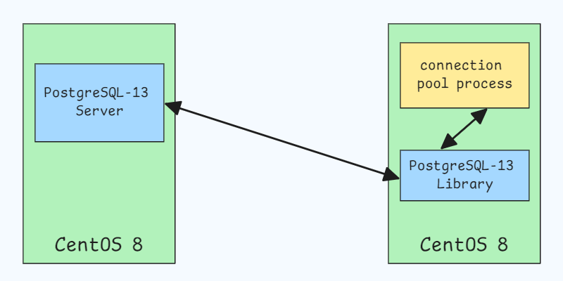
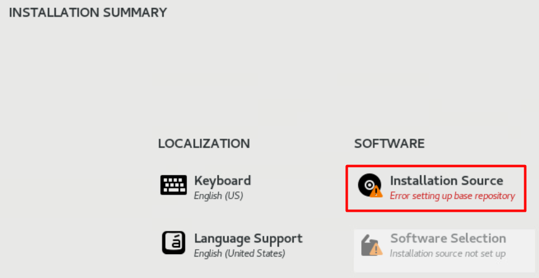
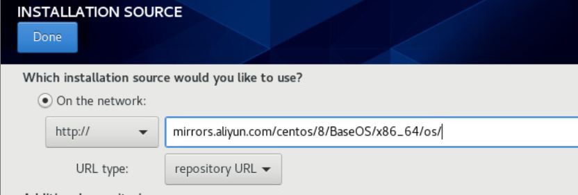
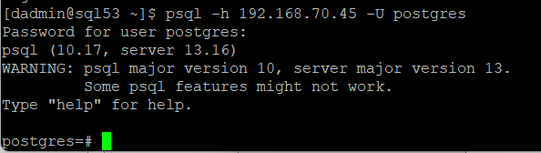

# Connection Pool

A **connection pool** is a managed cache of database connections that enables efficient reuse, reducing the need to open and close connections repeatedly. 

This optimization is widely used in database-driven applications to improve performance and resource utilization.


## Key Advantages

**Improved Performance**: Connection pooling minimizes the overhead of repeatedly opening and closing connections, resulting in faster query response times and enhanced application performance.

**Resource Efficiency**: By efficiently managing available connections, connection pools help prevent excessive idle connections, allowing more users to access the database concurrently without overloading it.

**Connection Management**: Connection pools handle connection acquisition, release, and lifecycle management, simplifying application code and reducing the risk of resource leaks.

**Fault Tolerance**: Many connection pools can automatically detect and replace failed connections, adding resilience to the application.

**Scalability**: Connection pooling supports efficient connection management across multiple application instances, enabling applications to scale smoothly in high-demand environments.

<br>

# Environment Setup

Since PostgreSQL 13 is widely implemented on Avaya Aura 10.1 servers, we’ll use it as the database for connection pool testing. 

The architecture is outlined below:



## Deploy CentOS 8
Since the base repository for CentOS 8 was removed on January 31, 2022, using boot.iso for installation may result in errors.



In this case, we need to manually specify an alternative source, such as `http://mirrors.aliyun.com/centos/8/BaseOS/x86_64/os/`.



<br>

After CentOS deployed, configure the correct Yum repository source by following steps:

```shell
# Create a backup directory for existing repo files in /etc/yum.repos.d/
sudo mkdir /etc/yum.repos.d/backup && sudo mv /etc/yum.repos.d/*.repo /etc/yum.repos.d/backup

# Download a new CentOS-Base.repo file from Aliyun's mirror and save it to /etc/yum.repos.d/
sudo wget -O /etc/yum.repos.d/CentOS-Base.repo http://mirrors.aliyun.com/repo/Centos-8.repo

# Refresh the repository cache and then upgrade all packages to the latest version
sudo dnf makecache && sudo dnf upgrade -y
```

## PostgreSQL 13 Server Setup

### Step 1: Install the Required CA Certificate
Before downloading the PostgreSQL repository, install the necessary CA certificate:

```shell
# Retrieve and save the CA certificate as postgresql_ca.pem
openssl s_client -showcerts -connect download.postgresql.org:443

# Add the CA certificate to the system's trusted anchors
cp postgresql_ca.pem /etc/pki/ca-trust/source/anchors/
update-ca-trust
```

### Step 2: Download and Install PostgreSQL 13

Follow the instructions at PostgreSQL's official website (`https://www.postgresql.org/download/linux/redhat/`) to deploy PostgreSQL 13 Server.

```shell
# Install the repository RPM:
sudo dnf install -y https://download.postgresql.org/pub/repos/yum/reporpms/EL-8-x86_64/pgdg-redhat-repo-latest.noarch.rpm

# Disable the built-in PostgreSQL module:
sudo dnf -qy module disable postgresql

# Install PostgreSQL:
sudo dnf install -y postgresql13-server

# Optionally initialize the database and enable automatic start:
sudo /usr/pgsql-13/bin/postgresql-13-setup initdb
sudo systemctl enable postgresql-13
sudo systemctl start postgresql-13
```

### Step 3: Configure Remote Access

To allow remote access to the PostgreSQL server:

```shell
# Set the "postgres" user password
sudo -u postgres psql
alter user postgres password '123';
\q

# Update configuration files to allow remote connections
# Edit pg_hba.conf to permit remote IPv4 access
sudo vi /var/lib/pgsql/13/data/pg_hba.conf
    # IPv4 local connections:
    host    all             all             0.0.0.0/0            scram-sha-256

# Edit postgresql.conf to allow connections on all IP addresses
sudo vi /var/lib/pgsql/13/data/postgresql.conf
    # - Connection Settings -
    listen_addresses = '*'

# Restart PostgreSQL to apply changes
sudo systemctl restart postgresql-13

# Open the PostgreSQL port in the firewall
sudo firewall-cmd --permanent --add-port=5432/tcp && sudo firewall-cmd --reload
```

## PostgreSQL 13 Client Setup

Setting up the PostgreSQL client is straightforward, as it will be used here only for testing purposes.

```shell
# Install the PostgreSQL client from the Yum repository
sudo dnf install postgresql

# Test the connection to the server 
psql -h <server_address> -U <username>
```

If the setup is successful, you should see a PostgreSQL prompt, indicating a successful connection to the server.



