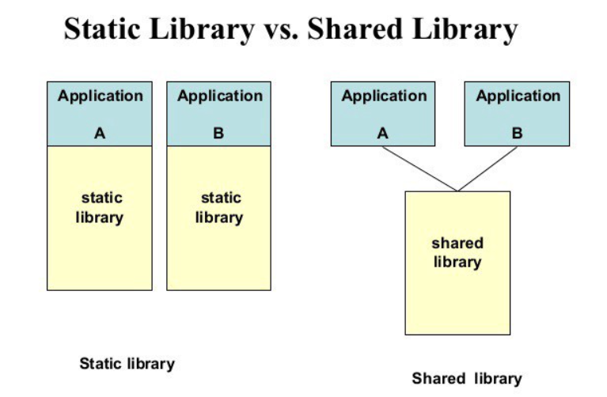
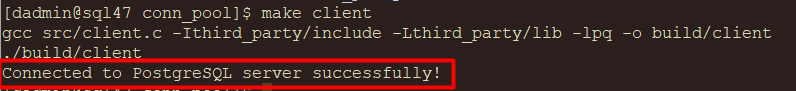

# Library

The library in computing are collections of precompiled code that programs use to perform common functions. Instead of rewriting code for each application, developers link to these libraries, making development faster, reducing redundancy, and standardizing routines across applications.

There are two main types of libraries: **static** and **dynamic**.



### Static Library

When an application is linked with a static library, the library’s code is embedded directly into the executable. This makes the program self-contained but increases its size since each executable contains its own copy of the library code. Static linking is useful when applications need to operate independently of the system’s library versions, ensuring they include all necessary functionality without external dependencies.

### Dynamic Library

Dynamic libraries, by contrast, are loaded into memory only once and shared across programs at runtime. Applications link to the library externally rather than embedding the code in the executable, reducing the program size and allowing multiple programs to share a single instance of the library. This memory-efficient approach also allows dynamic updates: if a dynamic library is updated, all programs using it can benefit from the improvements without needing to be recompiled.

## libpq

`libpq` is the C application programming interface (API) for PostgreSQL, providing a set of functions that allow client programs to communicate with the PostgreSQL database server. Through `libpq`, applications can send SQL queries to the PostgreSQL backend and retrieve results, abstracting away the complexities of database interaction and offering a straightforward API for database operations.

To use `libpq`, client programs need to include the `libpq-fe.h` header file and link to the `libpq` library. This allows the application to establish connections, execute SQL queries, retrieve results, and handle errors efficiently, making `libpq` an essential tool for integrating PostgreSQL functionalities within C applications.

<br>

# Build Development Environment

Currently, our client CentOS can only connect to the server with PostgreSQL utilities (like psql). 

To fully integrate PostgreSQL functions in a custom application, we need to install the PostgreSQL client library. Follow these steps to set up the development environment.

```shell
# Install development tools and dependencies
sudo dnf group install -y "Development Tools"
sudo dnf install -y git readline-devel

# Download PostgreSQL source code
cd ~
git clone https://github.com/postgres/postgres.git
cd postgres
git checkout REL_13_STABLE

# Compile and Install the client library (libpq).
./configure
make
make -C src/interfaces install

# Set up the project directory structure
cd ~ && mkdir conn_pool
mkdir src
mkdir -p third_party/include
mkdir -p third_party/lib
touch Makefile

# Copy libpq headers and library files to the project
cp ~/postgres/src/interfaces/libpq/libpq-fe.h ~/conn_pool/third_party/include
cp ~/postgres/src/include/*.h ~/conn_pool/third_party/include
cp ~/postgres/src/interfaces/libpq/libpq.so.5.13 ~/conn_pool/third_party/lib
cd ~/conn_pool/third_party/lib && ln -s libpq.so.5.13 libpq.so
```

## Create a Sample Program

With the development environment set up on the client CentOS, we can now write a program using the PostgreSQL client library (`libpq`) to connect to the server CentOS.

This simple example will:

- Establish a connection to the PostgreSQL server.
- Check the connection status and print an appropriate message.
- Close the connection.

The C code is as follows:

```c
#include <stdio.h>
#include "libpq-fe.h"

int main() {
    const char *conninfo = "host=192.168.70.46 port=5432 dbname=postgres user=postgres password=123";
    // Makes a new connection to the database server.
    PGconn *conn = PQconnectdb(conninfo);

    // Returns the status of the connection.
    if (PQstatus(conn) != CONNECTION_OK) {
        fprintf(stderr, "Connection to database failed: %s", PQerrorMessage(conn));
        // Closes the connection to the server. Also frees memory used by the PGconn object.
        PQfinish(conn);
        return 1;
    }

    printf("Connected to PostgreSQL server successfully!\n");
    PQfinish(conn);
    return 0;
}
```
In good case, you will see below output:

