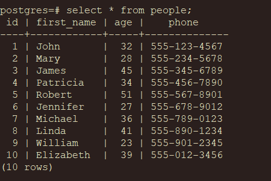

# PostgreSQL Basis

PostgreSQL is a powerful, open-source, **object-relational database management system (ORDBMS)** known for its reliability, advanced feature set, and strong SQL standards compliance.

t supports a wide range of data types and advanced capabilities such as **multi-version concurrency control (MVCC)**, complex queries, full-text search, and more. This makes PostgreSQL highly adaptable for applications requiring both flexibility and robust data management.

## Using the psql Terminal

`psql` is PostgreSQL’s interactive command-line client, allowing users to execute queries, manage the database, and perform various administrative tasks. 

In the psql environment, **meta-commands** (commands prefixed with a backslash) facilitate quick navigation and database management. Some commonly used meta-commands include:

| Meta-Command | Action |
|----------|----------|
| `\l`  | List all databases.  |
| `\c` [database_name]  | Connect to a specific database.  |
| `\du`  | List all users.  |
| `\dt`  | Display tables in the current database.  |
| `\d` [table_name]  | Show the structure (columns and types) of a table.  |
| `\e`  | Open a multi-line SQL editor.  |
| `\q`  | Quit the psql terminal.  |


## Basic SQL Usage

**Structured Query Language (SQL)** is the standard programming language used to manage and manipulate relational databases. SQL can be executed directly within the `psql` terminal.


### Creating a Table

To start, let’s create a table named people with an auto-incrementing id, first_name, age, and phone fields.

```sql
CREATE TABLE people (
    id SERIAL PRIMARY KEY,              -- Auto-incrementing primary key
    first_name VARCHAR(50) NOT NULL,    -- First name
    age INT CHECK (age > 0),            -- Age, must be a positive integer
    phone VARCHAR(15)                   -- Phone number
);
```


### Inserting Data

After defining the table structure, we can insert sample data to work with:

```sql
INSERT INTO people (first_name, age, phone) VALUES
('John', 32, '555-123-4567'),
('Mary', 28, '555-234-5678'),
('James', 45, '555-345-6789'),
('Patricia', 34, '555-456-7890'),
('Robert', 51, '555-567-8901'),
('Jennifer', 27, '555-678-9012'),
('Michael', 36, '555-789-0123'),
('Linda', 41, '555-890-1234'),
('William', 23, '555-901-2345'),
('Elizabeth', 39, '555-012-3456');
```





### CRUD Operations

Once data is in place, we can perform CRUD (Create, Read, Update, Delete) operations to manage and retrieve it.

**Create: Insert a New Record**

Adding new data is done with the `INSERT INTO` statement:

```sql
INSERT INTO people (first_name, age, phone) VALUES ('Andrew', 44, '555-012-6789');
```

**Read: Query Data**

Retrieve data using `SELECT`. Here, * means selecting all columns in the people table.

```sql
SELECT * FROM people;
```

his command will display each row in the table, including each person’s id, first_name, age, and phone number.


**Update: Modify Existing Records**

To modify a record, use UPDATE with a WHERE clause to specify the target row. Below, we update Andrew’s age to 18:

```sql
UPDATE people SET age = 18 WHERE first_name = 'Andrew';
```

**Delete: Remove a Record**

To remove a specific record, use DELETE FROM with a WHERE clause. Here, we delete the record for Andrew:

```sql
DELETE FROM people WHERE first_name = 'Andrew';
```
Executing this command will permanently remove the row where first_name is Andrew.

