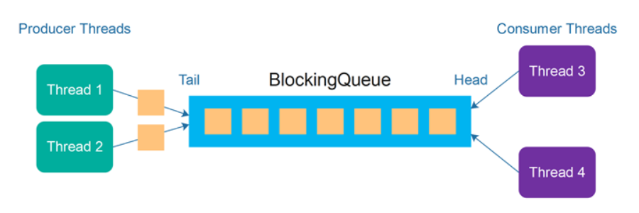

# Producer-Consumer pattern in Database Connection Pools

The **Producer-Consumer design pattern** is a widely used concurrency model that allows efficient task handling in multi-threaded systems. It is particularly useful in systems where the generation of tasks and their processing can be decoupled. 



In this pattern, there are three primary components: the **producer**, the **consumer**, and the **task queue**.


**Producers**: In the context of a database connection pool, the producers are the client threads that generate SQL queries. These client threads are responsible for requesting specific database operations, such as retrieving data, updating records, or executing transactions. However, instead of executing the queries directly, the client threads enqueue them into a task queue, where they will be picked up by the worker threads (the consumers) for processing.

**Consumers**: The consumer threads are the worker threads within the database connection pool. These threads are responsible for executing the SQL queries submitted by the producers. Each worker thread holds a database connection and, when it picks up a task from the queue, it uses the connection to execute the query. After completing the task, the worker thread can return to the queue to pick up the next task.

**Task Queue**: The task queue acts as an intermediary between the producers and consumers. It is where the tasks (in this case, SQL queries) are temporarily stored before being processed by the consumer threads. The task queue has several roles: it buffers tasks, ensures that consumers are not overwhelmed by an excessive number of tasks, and prevents producers from blocking when the queue is full. The queue ensures that tasks are processed in a fair and orderly manner.

## Design of Task Queue

The task queue plays a central role in the Producer-Consumer model, ensuring that tasks flow smoothly between the producers and consumers. The task queue must be carefully designed to handle concurrency, buffer tasks efficiently, and manage the synchronization of multiple threads.

The task queue should have basic functionality like enqueuing and dequeuing tasks. Below is an example of how such a queue might be implemented:

```c
// Initializes the task queue
task_queue* task_queue_init(int queue_size) {
    // Allocate memory for the task queue structure and initialize necessary variables
    // Initialize the task array to hold tasks
    // Return the initialized task queue
}

// Enqueue a task into the task queue
int task_queue_enqueue(task_queue* queue, const char* task) {
    // If the queue has space, add the task to the queue if 
    // Update the front pointer and increase the size of the queue
}

// Dequeue a task from the task queue
char* task_queue_dequeue(task_queue* queue) {
    // If the queue has any tasks, Remove the task from the queue
    // Update the rear pointer and decrease the size of the queue
}

// Destroy the task queue and free allocated memory
void task_queue_destroy(task_queue* queue) {
    // Free the memory used for the task array and the queue structure
    // Clean up any allocated memory used by the tasks
}

```

## Design of Producer and Consumer

With the task queue designed, we can now focus on implementing the Producer and Consumer components. In our case, the producers will be the client threads that generate SQL queries, and the consumers will be the worker threads in the connection pool that process those queries.

### Producer: Client Threads

The producer threads are responsible for generating SQL queries and enqueuing them into the task queue. This operation is asynchronous, meaning that the producer thread does not need to wait for the task to be processed. Instead, it simply enqueues the task and moves on to the next operation. This enables the producer to continue generating tasks without being blocked by the consumer thread.

```c
// Submits an SQL query to the connection pool
void db_connection_pool_query(db_connection_pool* pool, char* sql_query) {
    // Ensure that the queue is not full before enqueuing
    // Enqueue the SQL query into the task queue
    // Signal the consumer threads that the task queue isn't empty
}
```

### Consumer: Worker Threads

The consumer threads are responsible for processing the tasks generated by the producers. Each consumer thread will continuously monitor the task queue for new tasks. When a new task is found, the consumer dequeues the task, executes the SQL query, and returns the result to the client. After completing the task, the consumer will return to the task queue to pick up the next query.

```c
// Processes an SQL query from task queue
void* db_worker_thread(void* arg) {
    // Initialize a database connection
    // Ensure that the queue is not empty before dequeuing
    // Dequeue a task and execute the SQL query using the database connection
    // Signal the producer threads that the task queue isn't full
}
```