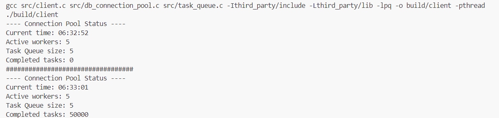

# Performance Evaluation

To evaluate the performance of a connection pool, we created a client application for comparison that does not utilize a connection pool.

**Connection Pool Version**: uses a connection pool, allowing five concurrent SQL connections for database operations. It completed 50,000 SQL queries in **9** seconds.



<br>

**Single Connection Version**: processes all SQL queries through a single shared connection, completing the same 50,000 SQL queries in **23** seconds.


<br>

The results clearly show that the connection pool version significantly outperformed the single connection version, reducing total execution time by more than half.

# Connection Pool Size

In a connection pool, the **pool size** typically represents **the number of worker threads or database connections** that the application can use to interact with the database. Each worker thread is usually assigned a separate database connection. This is because most database drivers and APIs are designed to work in a **one-to-one fashion**, where each thread gets a dedicated connection to handle queries or transactions. 

For instance, if you have a connection pool with 10 threads, there will be 10 concurrent database connections available, allowing up to 10 database queries to be processed in parallel. 

## The Problem with Too Many Threads

When configuring a connection pool, having too many threads can actually hurt performance instead of improving it. 

- **Thread Switching Overhead**: Each time a thread is scheduled, the operating system performs context switching, saving the current thread's state and loading the next. With more threads than available CPU cores, the system spends considerable time switching between threads, which leads to performance degradation. This overhead increases with the number of threads, and once the number of threads exceeds the number of CPU cores, additional threads offer no performance benefits.

- **I/O Wait**: Many database queries involve reading from or writing to disk. If the system is relying on a single disk for all database I/O, additional threads won’t speed up the process. Instead, they will only lead to more threads waiting for I/O resources to become available. In this case, increasing the number of threads won’t reduce the time spent waiting for disk access.

- **Increased Resource Contention**: Adding more threads increases competition for CPU, memory, and network resources, which can further degrade system performance. For example, if too many threads attempt to access the network or database simultaneously, it could lead to network saturation or database locking, which causes delays and reduces overall throughput.


## Less is More

Connection pooling helps by reusing a fixed number of connections, which limits the number of threads actively working with the database. However, finding the right pool size is crucial. Too many threads can cause over-provisioning, leading to slowdowns due to excessive context switching and blocking, as the system struggles to manage too many active threads.

The optimal connection pool size can be calculated using the formula:

```
connections = ((core_count * 2) + effective_spindle_count)
```

For example, for a 4-core server and one disk, the pool should ideally have around 9 connections:

```
9 = ((4 * 2) + 1)
```

If the client application and database are on separate systems, `core_count` refers to **the CPU core count of the client application’s system**, while `effective_spindle_count` refers to **the number of disks available on the database system**. 

Using this formula, you can find the right connection pool size that optimizes performance and resource usage, helping to avoid wasting resources or not having enough.
